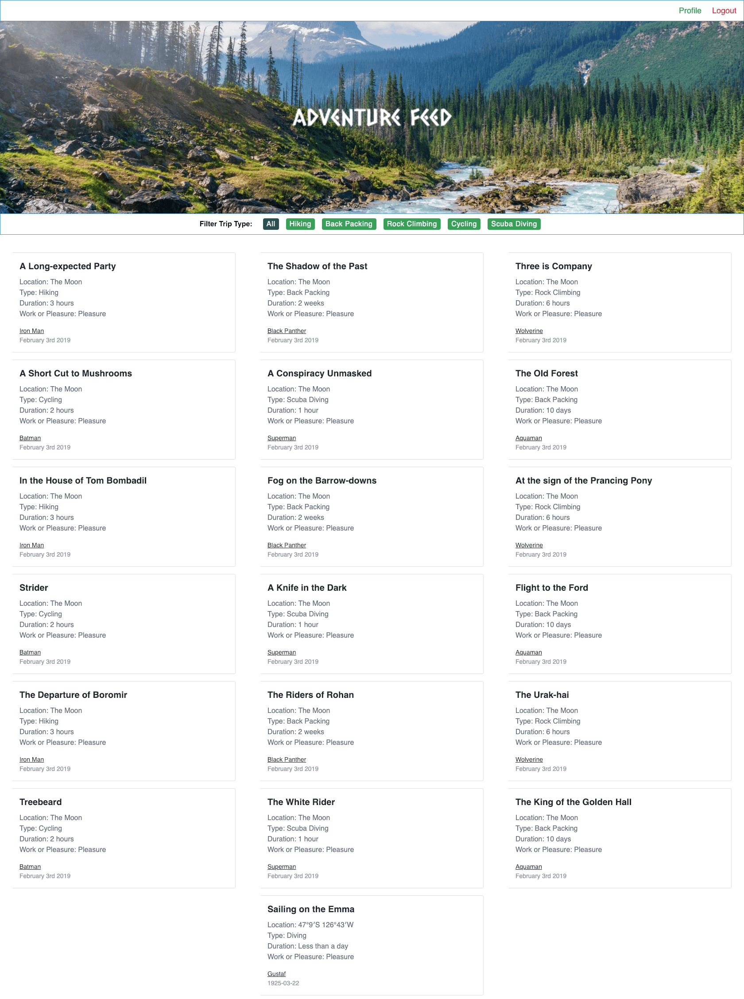

# Guidr App

## By The Guidr Team

- UI team: Steven Jefferson, James Goodnight, Itel Domingo
- Lead Frontend Developer: Matt Basile
- Lead Backend Developer: Asa Shalom
- Scrum Master: Timothy Hoang

## To view this app online

- To view deployed app, visit: [Guidr Home](https://guidr2.netlify.com/)
- Info at the end to edit the source code

## About

- [Guidr](https://guidr2.netlify.com/) is an app that helps backcountry guides of all types log their private/professional trips.
- Sign up for an account, add adventures, see different profile
- Currently: Stable Version v1.0 -- updates are possible, not currently planned (as of 2/8/2019)

## Features

- A powerful front-end platform built with React, Redux, React Router, Axios, Greensock, and Tailwind CSS
- Sign up and log into your own account
- Ability to add full name, location, and bio to a user's account
- Add/update/delete adventures
- Check out adventures in the Newsfeed
- Check out user's profiles

## Technologies for this project

- [React](https://reactjs.org/)
- [Redux](https://redux.js.org/)
- [React Router](https://github.com/ReactTraining/react-router)
- [Axios](https://www.npmjs.com/package/axios)
- [Greensock](https://www.npmjs.com/package/gsap)
- [Web Font Loader](https://www.npmjs.com/package/webfontloader)

## Possible Updates

1. Based on the "duration" of each trip, in hours, aggregate the trip durations and have a widget that displays how many private and professional hours the current guide has across their various categories.
2. Allow users to upload photos to their trips.
3. Allow users to download a professional resume that lays out their information.
4. CRUD operations for users

## To edit the source code

- Github Repo: [Guidr Client Repo](https://github.com/guidr-app-lion-team/guidr-client-deploy)
1. Have stable NPM and NodeJS versions installed on your computer
2. Navigate to the directory of choice and type `git clone https://github.com/guidr-app-lion-team/guidr-client-deploy.git`
3. Install necessary packages either with `npm install` or `yarn`
4. Run the client with `npm start` or `yarn start`, then navigate to `http://localhost:3000/` to see the client
5. Open up the codebase with your favorite editor and hack away!

## More pictures

### Login Page

### Registration Page

### Adventure Feed Page

### Add Adventure  Page

### Profile Feed Page

